## introduction

1. [kubernnetes illustrated for childrens](https://youtu.be/Q4W8Z-D-gcQ)
2. `Kubernetes` uses labels as "nametags" to dientyfy things and it can query based on these labels
3. Kubernetes is a `self-healing"` system - usually, you (the maintainer or the developer) don't have to do anything in case something goes wrong with a pod or a container.

## Pods

1. A runable unit of work
2. usually run a single container inside a pod but in cases where the containers are tightly coupled , more than one container can be run inside a same pod
3. K8s takes on the task to connect a pod to external network and rest of the environment of the K8s
4. it is deleted if the containers within stop running and contained files will be lost with it.
5. With a pod, you can run closely related processes together, giving them (almost) the same environment as if they were all running in a single container.

## Replecation Controllers

1. responsible for creating a method to manage any arbitary number of pods
2. contains a pod template that can be replicated any number of times
3. through replication controllers k8s will manage the entire lifecycle of pod including scaling up and down, rolling deployments and monitoring.

## Service

1. A service tells rest of k8s env including other pods and replication env what services your app provides
2. the pods may come and go but the ip addresses and ports of the service remains persistent
3. other app can find servies through the k8s service discovery
4. Service resources will take care of serving the application to connections from outside (and also inside!) of the cluster.

## Volume

1. providers expose both ephemeral and persistent storages: EBS, Ceph, Gluster
2. for container to store and access other information
3. pods can mount volumes like files systems

## Namespace

1. grouping mechanism inside the k8S
2. services, volumes, pods can easily collaborate within a namespace
3. but namespace provides a degree of isolation from other parts of the cluster

## cluster

1. a group of machines i.e nodes that work together
2. can be of any size
3. a single node cluster would consist of one machine that hosts the k8s control panel(exposing API and maintaining the cluster)
4. that cluster can then be expanded upto 5000 nodes total, as of Kubernetes v1.18.
   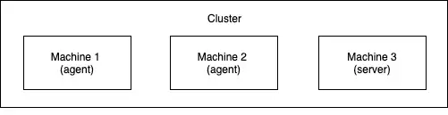

## Kubectl

- Kubectl is the Kubernetes command-line tool and will allow us to interact with the cluster.
- kubectl sill read the config from location in env var `KUBECONFIG` or default location `~/.kube/config` and use the info to connect to the cluster

## Deployment

- to deploy an application, we need to create a deployment object with the image.

## NodePort

- NodePorts are simply ports that are opened by Kubernetes to all of the nodes and the service will handle requests in that port.
- NodePorts are not flexible and require you to assign a different port for every application
- NodePorts are not used in production but are helpful to know about.

## Commands

[link to kubernetes command pages](https://kubernetes.io/docs/reference/kubectl/docker-cli-to-kubectl/)

```bash
kubectl explain RESOURCE i.e. pod # find information about the different resources Kubernetes has
kubectl get RESOURCE i.e. pods # list all objects of a resource
```

## Actions when we deploy an app

These actions take place when you deploy the application:

1. You submit the application manifest to the Kubernetes API. The API
   Server writes the objects defined in the manifest to etcd.
2. A controller notices the newly created objects and creates several new
   objects - one for each application instance.
3. The Scheduler assigns a node to each instance.
4. The Kubelet notices that an instance is assigned to the Kubelet’s node. It
   runs the application instance via the Container Runtime.
5. The Kube Proxy notices that the application instances are ready to
   accept connections from clients and configures a load balancer for them.
6. The Kubelets and the Controllers monitor the system and keep the
   applications running.

## managed Kubernetes offerings

The top managed Kubernetes offerings include the following:
Google Kubernetes Engine (GKE)

1. Azure Kubernetes Service (AKS)
2. Amazon Elastic Kubernetes Service (EKS)
3. IBM Cloud Kubernetes Service
4. Red Hat OpenShift Online and Dedicated
5. VMware Cloud PKS
6. Alibaba Cloud Container Service for Kubernetes (ACK)

## Main parts in an object

The manifest of most Kubernetes API objects consists of the following four
sections:

1. Type metadata: describes about the type of the object, the group it belongs to and the api version
2. Object metadata: contains basic info about the object instance, like name, time of creation, owner, and other identifying information. The fields in this metadata are same of all object types.
3. Spec: explains the desired state of the obj. this is seperate for each object type.for pods: pod's containers, storage,volumes and other info related to the pod
4. status: current actual state of the object. for pod: condition of the pod, status of each container, its ip, node it's running on and other info about what's happening in the pod
   > Note: the controller is the thing that reads the Spec and writes the Status of the object.

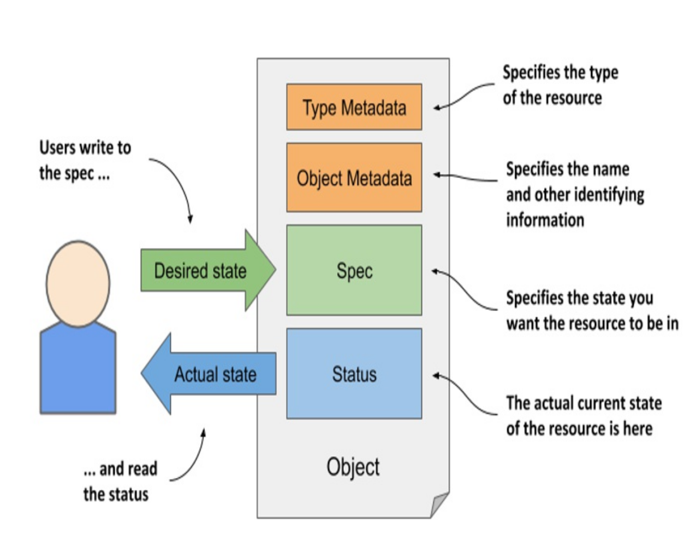

## The Type Metadata fields

1. The manifest starts with the apiVersion and kind fields,
   which specify the API version and type of the object that this object manifest
   specifies
2. For Deployment objects, for example, the apiVersion is
   apps/v1.
3. The type of object defined in the manifest is specified by the field kind i.e. Deployment, Service, Pod, Node

## Fields in the Object Metadata section

1. The metadata section contains the metadata of this object instance
2. It contains the name of the instance, along with additional attributes such as labels and annotations

## Fields in the Spec section

1. podCIDR fields specify the pod IP range assigned to the node

## Fields in the Status section

1. it contains the last observed state of the thing the object represents
2. For Node objects, the status reveals the node’s IP address(es), host name, capacity to provide compute resources, the current conditions of the node, the container images it has already downloaded and which are now cached locally, and information about its operating system and the version of Kubernetes components running on it.

## Understanding an object’s status conditions

```console
k get nodes k3d-k3s-default-server-0 -o json | jq .status.conditions
```

```json
[
	{
		"lastHeartbeatTime": "2024-07-09T10:44:14Z",
		"lastTransitionTime": "2024-07-09T07:05:36Z",
		"message": "kubelet has sufficient memory available",
		"reason": "KubeletHasSufficientMemory",
		"status": "False",
		"type": "MemoryPressure"
	},
	{
		"lastHeartbeatTime": "2024-07-09T10:44:14Z",
		"lastTransitionTime": "2024-07-09T07:05:36Z",
		"message": "kubelet has no disk pressure",
		"reason": "KubeletHasNoDiskPressure",
		"status": "False",
		"type": "DiskPressure"
	},
	{
		"lastHeartbeatTime": "2024-07-09T10:44:14Z",
		"lastTransitionTime": "2024-07-09T07:05:36Z",
		"message": "kubelet has sufficient PID available",
		"reason": "KubeletHasSufficientPID",
		"status": "False",
		"type": "PIDPressure"
	},
	{
		"lastHeartbeatTime": "2024-07-09T10:44:14Z",
		"lastTransitionTime": "2024-07-09T07:05:36Z",
		"message": "kubelet is posting ready status",
		"reason": "KubeletReady",
		"status": "True",
		"type": "Ready"
	}
]
```

1. The lastTransitionTime field indicates when the condition
   moved from one status to another, whereas the lastHeartbeatTime field
   reveals the last time the controller received an update on the given condition
2. the Ready condition signals whether the node is ready to accept new
   workloads (pods)
3. The other conditions (MemoryPressure, DiskPressure and PIDPressure) signal whether the node is running out of resources

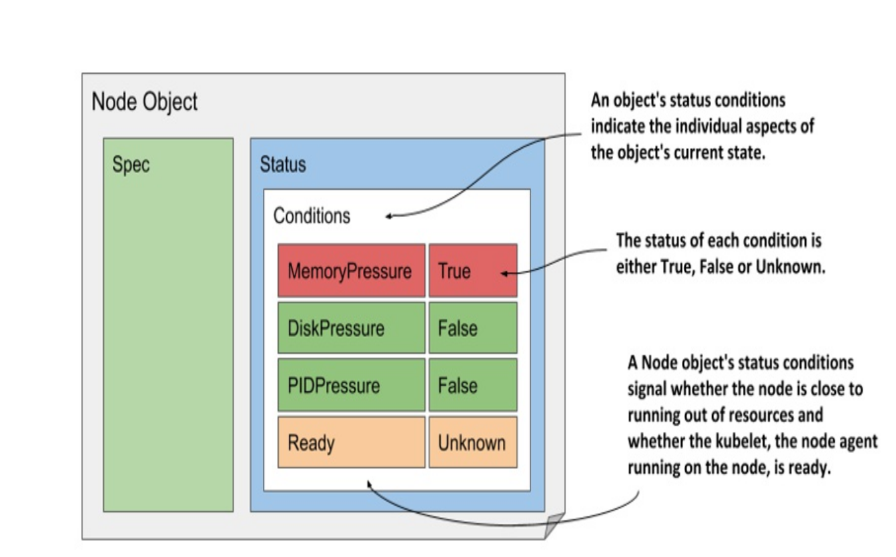

## Observing cluster events via Event objects

1. Two types of events exist: Normal and Warning.
2. Events of the latter type are usually generated by controllers when something prevents them from reconciling the object
3. Events are represented by Event objects that are created and read via the Kubernetes API
4. Unlike other objects, each Event object is deleted one hour after its creation to reduce the burden on etcd, the data store for Kubernetes API objects.

```bash
kubectl get ev --field-selector type=Warning
```

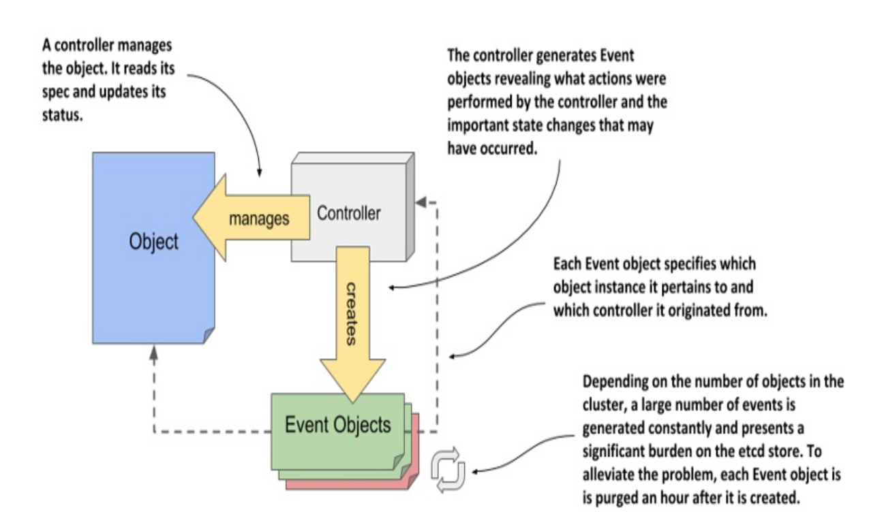

## Understanding why one container shouldn’t contain multiple processes

Containers are designed to run only a single process, not counting any child processes that it spawns. Both container tooling and Kubernetes were developed around this fact.

1. If a container contains multiple processes, it'll be diffficult to seperate the logs of all the processes as they all will be intertwined in a single standard output.
2. Another indication that containers should only run a single process is the fact that the container runtime only restarts the container when the container’s root process dies. It doesn’t care about any child processes created by this root process. If it spawns child processes, it alone is responsible for keeping all these processes running.

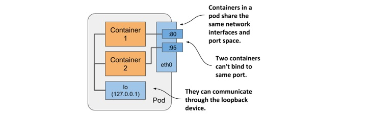

## Splitting an application stack into pods

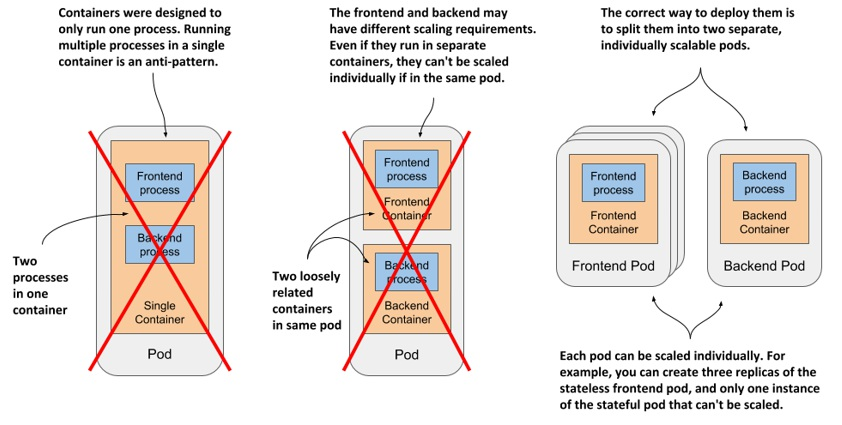

## How to decide whether to split containers into multiple pods

When deciding whether to use the sidecar pattern and place containers in a
single pod, or to place them in separate pods, ask yourself the following
questions:

- Do these containers have to run on the same host?
- Do I want to manage them as a single unit?
- Do they form a unified whole instead of being independent components?
- Do they have to be scaled together?
- Can a single node meet their combined resource needs?

As a rule of thumb, always place containers in separate pods unless a specific reason requires them to be part of the same pod.

## create manifest file from scratch

`kubectl run kiada --image=luksa/kiada:0.1 --dry-run=client -o yaml > mypod.yaml`. The --dry-run=client flag tells kubectl to output the
definition instead of actually creating the object via the API.

## Connecting to pods via kubectl port forwarding

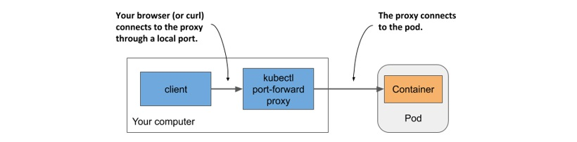

## The long communication path between curl and the container when using port forwarding

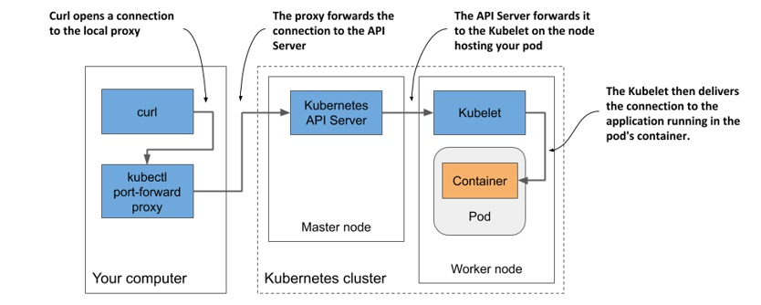

## Init containers in pod

In a pod manifest, init containers are defined in the initContainers field in the spec section, just as regular containers are defined in its containers field.

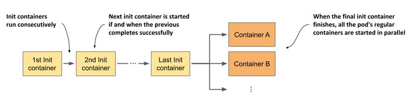

### importance of init containers

- Initialize files in the volumes used by the pod’s main containers. This includes retrieving certificates and private keys used by the main container from secure certificate stores, generating config files, downloading data, and so on.
- Initialize the pod’s networking system. Because all containers of the pod share the same network namespaces, and thus the network interfaces and configuration, any changes made to it by an init container also affect the main container.
- Delay the start of the pod’s main containers until a precondition is met. For example, if the main container relies on another service being available before the container is started, an init container can block until this service is ready.
- Notify an external service that the pod is about to start running. In special cases where an external system must be notified when a new instance of the application is started, an init container can be used to deliver this notification.

## Deleting a pod

you may wonder if you can stop a pod and start it again later, as you can with Docker containers. The answer is no. With Kubernetes, you can only remove a pod completely and create it again later.

> Note: deleting the pods created by deployment will recreate exact number of pods again. The controller responsible for bringing Deployment objects to life
> must ensure that the number of pods always matches the desired number ofreplicas specified in the object. When you delete a pod associated with the Deployment, the controller immediately creates a replacement pod. To delete these pods, you must either scale the Deployment to zero or delete the object altogether.

## Life cycle of a pod

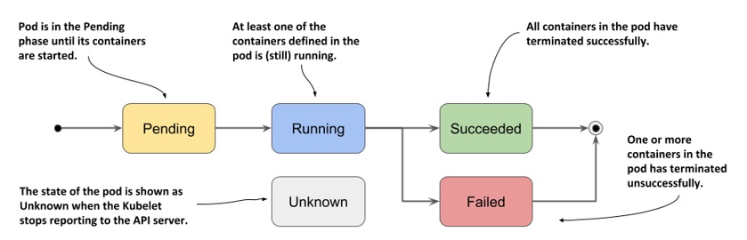

## Life cycle of a container

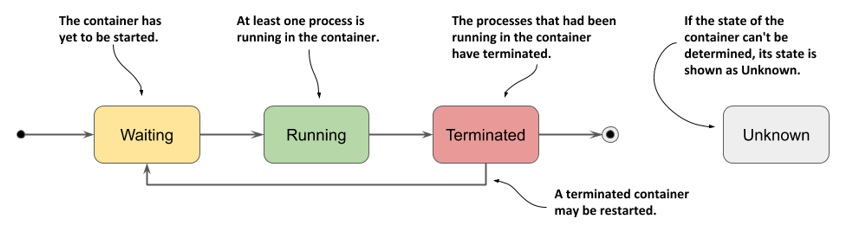

## Container's restart policy

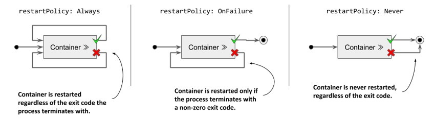

- As shown in the following figure, the first time a container terminates, it is restarted immediately. The next time, however, Kubernetes waits ten seconds before restarting it again. This delay is then doubled to 20, 40, 80 and then to 160 seconds after each subsequent termination. From then on, the delay is kept at five minutes. This delay that doubles between attempts is called exponential back-off.

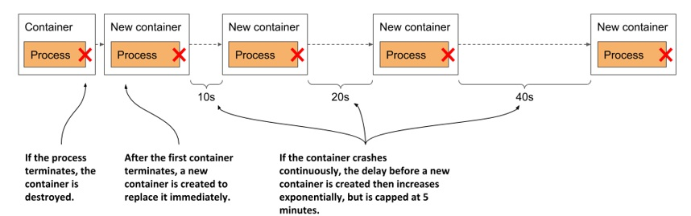

The delay is reset to zero when the container has run successfully for 10 minutes. If the container must be restarted later, it is restarted immediately.

## liveness probe

Kubernetes can be configured to check whether an application is still alive by defining a liveness probe. You can specify a liveness probe for each container
in the pod. Kubernetes runs the probe periodically to ask the application if it’s still alive and well. If the application doesn’t respond, an error occurs, or the response is negative, the container is considered unhealthy and is terminated. The container is then restarted if the restart policy allows it. Liveness probes can only be used in the pod’s regular containers. They can’t be defined in init containers.

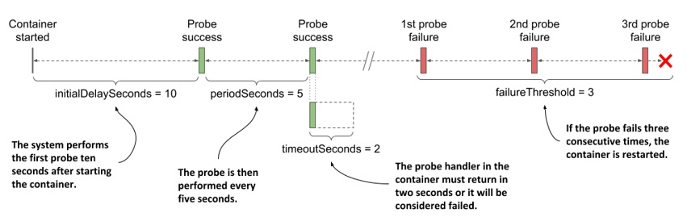

The parameter `initialDelaySeconds` determines how long Kubernetes should delay the execution of the first probe after starting the container. The `periodSeconds` field specifies the amount of time between the execution of two consecutive probes, whereas the `timeoutSeconds` field specifies how long to wait for a response before the probe attempt counts as failed. The `failureThreshold` field specifies how many times the probe must fail for the container to be considered unhealthy and potentially restarted.

## Volumes

The Kubernetes volumes, in technical terms emptyDir volumes, are shared filesystems inside a pod, this means that their lifecycle is tied to a pod.

## Persistent Volumes

- A Persistent Volume (PV) is a cluster-wide resource, that represents a piece of storage in the cluster that has been provisioned by the cluster administrator or is dynamically provisioned. Persistent Volumes can be backed by various types of storage such as local disk, NFS, cloud storage, etc.
- PVs have a lifecycle independent of any individual pod that uses the PV. This means that the data in the PV can outlive the pod that it was attached to.
